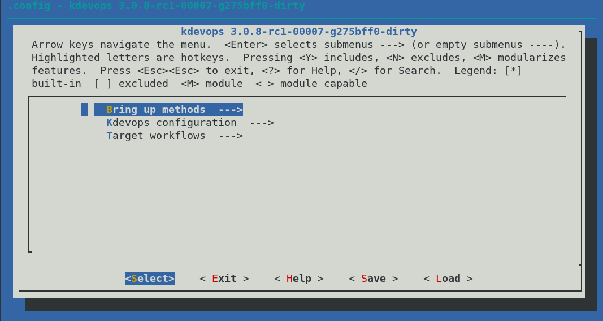
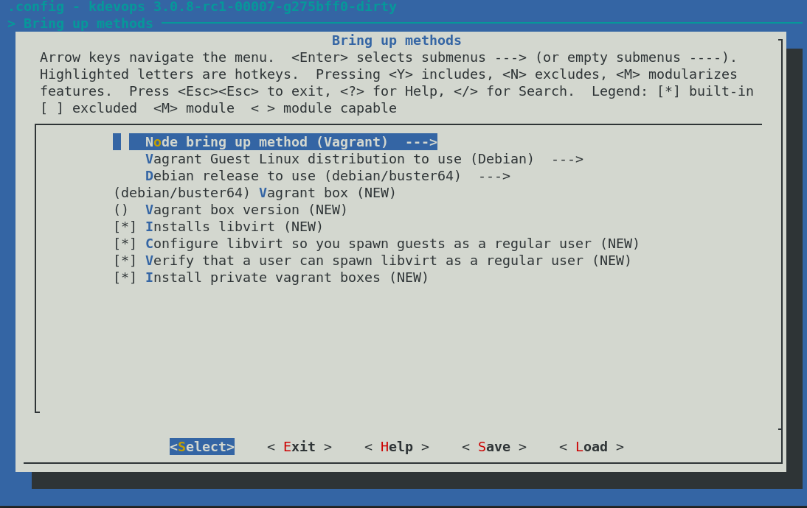
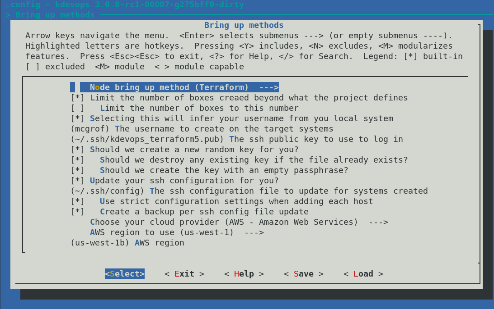
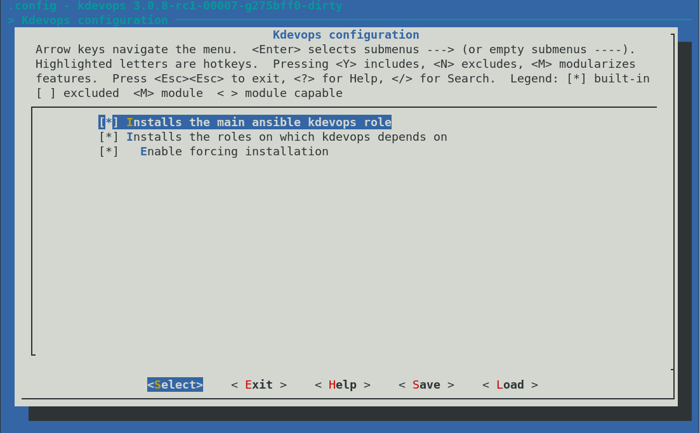
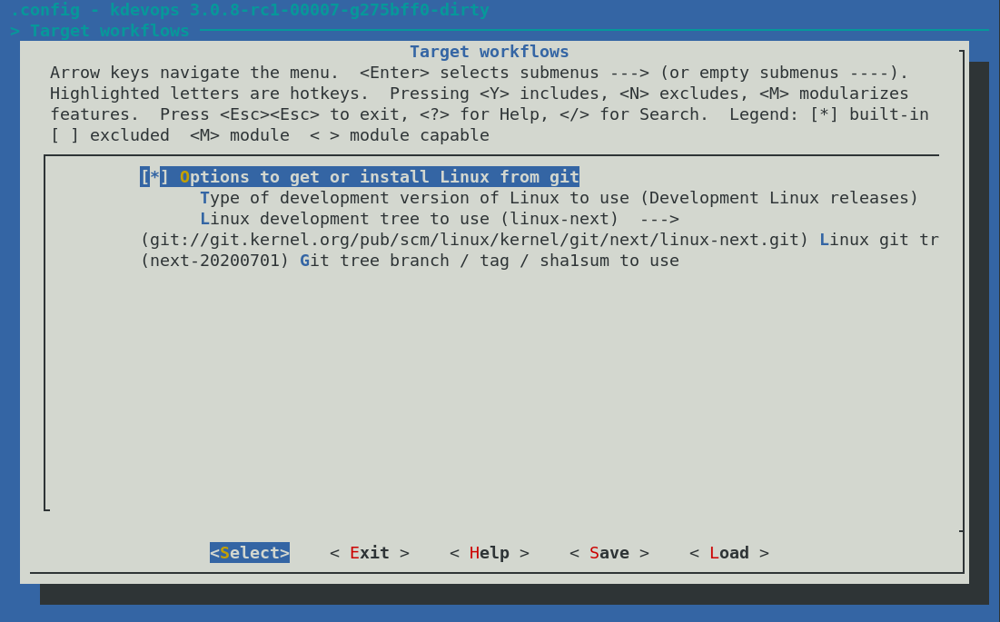

# kdevops

kdevops provides a devops environment for Linux kernel development and testing.
It makes heavy use of public ansible galaxy roles and optionally lets you use
vagrant or terraform. kdevops is Linux distribution agnostic, and also supports
OS X. It aims at letting you configure these tools and bring up a set
of nodes for Linux kernel development as fast as possible.

You can use this project as a template, or you can fork it for your own needs.

kconfig support is provided, to allow you to configure which features from
kdevops you want to use and get up and running on a fresh version of linux
in just 4 commands:

  * `make menuconfig`
  * `make`
  * `make bringup`
  * `make linux`

Once kdevops is configured, there are 3 main parts to what kdevops will do
for you:

  * Bring up
  * Make systemse easily accessible, and install generic developer preferences
  * Run defined workflows


## Requirements for kdevops

You must be on a recent rolling Linux distribution or OS X. You must have
installed:

  * ansible
  * python
  * ncurses-devel

If you enable vagrant or terraform *we* try to install it for you along with
their dependencies, including the vagrant-libvirt plugin. The dependency chain
for vagrant or terraform can get complex quite fast. Even if your distribution
does not have a package for these we support installing from the latest zip
file releases, however installing manually can get complicated fast later,
specially with vagrant-libvirt. Examples of well tested rolling distributions
recommended:

  * Debian testing
  * OpenSUSE Tumbleweed

## Configuring kdevops

kdevops provides support for vagrant, terraform, bare metal, and optionally
helps you install and configure libvirt, as well as let you choose which git
tree for Linux to compile, install and boot into, along with which sha1sum to
use, and apply any extra patches you might have. The last step of booting into
a particular version of Linux is only the beginning of what can be accomplished
with kdevops, it is just a core demonstration of the infrastructure. You are
encouraged to expand on it for your own needs and a few more elaborate projects
are referenced later.

What a target system may need will vary depending on your needs and your
preferences and so the Linux modeling variability language, kconfig, has been
embraced to allow users to configure how kdevops is to be used. You choose
whether or not to use vagrant, terraform, bare metal, and what bells or
whistles to turn on or off.

To configure kdevops use:

```bash
make menuconfig
```

Below are a few screnshots of the current options avialable when
configuring kdevops:











## Getting help with configuration

```bash
make help
```

## Installing dependencies

Once done with configuration we must install all dependencies, and generate
configuration files which will be used later during bring up. To do this
run:

```bash
make
```

## Bring up nodes

To get your systems up and running and accessible directly via ssh, just do:

```bash
make bringup
```

At this point you should be able to run:

  * `ssh kdevops`
  * `ssh kdevops-dev`

We provide two hosts by default, one to be used as a baseline for your kernel
development, and another for development.

## Booting into a configured version of Linux

Now, to get the configured version of Linux on the systems we just brought up,
all you have to run is:

```bash
make linux
```

Immediately after this you should be able to ssh into either system, and `uname
-r` should disply the kernel you configured.

## Destroying nodes

Just do:

```bash
make destroy
```

---

# Underneath the kdevops hood

Below are sections which get into technical details of how kdevops works.

  * [One ansible role to rule them all](docs/one-ansible-role.md)
  * [kconfig integration](docs/kconfig-integration.md)
  * [Motivation behind kdevops](docs/motivations.md)
  * [Linux distribution support](docs/linux-distro-support.md)
  * [Overriding all ansible role options with one file](docs/ansible-override.md)
  * [Parts to kdevops](docs/parts-to-kdevops.md)
  * [kdevops projects](docs/kdevops-projects.md)
  * [kdevops vagrant support](docs/kdevops-vagrant.md)
  * [kdevops terraform support](docs/kdevops-terraform.md)
  * [kdevops ansible roles](docs/ansible-roles.md)

License
-------

This work is licensed under the GPLv2, refer to the [LICENSE](./LICENSE) file
for details. Please stick to SPDX annotations for file license annotations.
If a file has no SPDX annotation the GPLv2 applies. We keep SPDX annotations
with permissive licenses to ensure upstream projects we embraced under
permissive licenses can benefit from our changes to their respective files.
