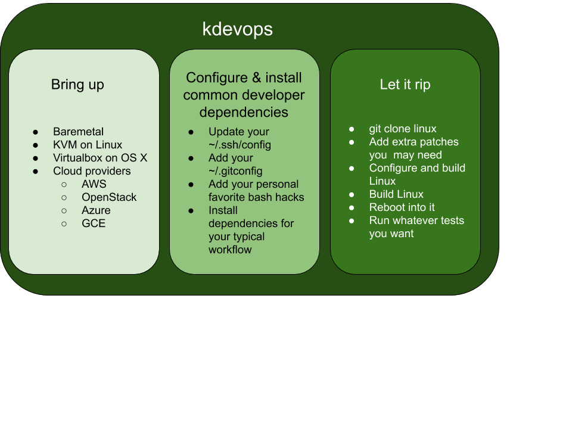

# kdevops

kdevops provides a devops environment for Linux kernel development and testing.
It makes heavy use of public ansible galaxy roles and optionally lets you use
vagrant or terraform. kdevops is Linux distribution agnostic, and also supports
OS X.

This particular project is an example demo project which makes use of the
kdevops ansible role to let you ramp up with a Linux kernel development
and testing environment fast. You can use this as a template, or you can
fork it for your own needs.



## Motivation

A tedious part about doing Linux kernel development or testing is ramping up
a set of systems for it. For instance, settings up a test bed for testing
Linux filesystems can often take weeks. kdevops was born with an initial goal
to reduce this amount of time to a couple of minutes. It turns out that
doing this correctly for baremetal, but also in a virtualization-neutral and
cloud-neutral way, is useful for many other things than just Linux filesystems
testing, and so kdevops was born to generalize bring up for Linux kernel
development and testing as fast as possible.

## One ansible role to rule them all

Each ansible role and terraform module which kdevops uses focuses on one
specific small goal of the development focus of kdevops. Since the number of
ansible roles which kdevops makes use of has grown, and we don't want to deal
with the complexities of 'galaxy collections', we rely on *one* galaxy role to
let you install all the rest of the kdevops dependencies for you:

  * `kdevops_install`

This project synchronizes releases based on that role's own releases, and
so there is parity in release numbers between both of these projects to
reflect this.

## Be lazy and override all settings in one optional file

To help users easily override role variables *all* of the kdevops ansible roles
look for optional extra argument files, which you can use to override *all*
role defaults. This is a `kdevops` thing, to help you be lazy. Since ansible
roles are expected to be defined in a directory, we look at the parent directory
for these optional files, and use the first one found. The oder of the files
we look for is:

  * `extra_args.yml`
  * `extra_args.yaml`
  * `extra_args.json`

## Fork me

You can either fork this project to start your own kdevops project, or you can
rely on the bare bones `kdevops_install` ansible galaxy role to get going and
use this project as an example of how to use that ansible role.

## Parts to kdevops

There are four parts to the long terms ideals for kdevops:

0. Installing ansible roles required
1. Optional provisioning required for virtual hosts / cloud environment
2. Provisioning your requirements
3. Running whatever you want

Ansible is first used to get all the required ansible roles.

Vagrant or terraform can then optionally be used to provision hosts. You don't
need to use vagrant or terraform if you are using baremetal hosts.

Vagrant makes use of three ansible roles to let you use libvirt as a regular
user, update your `~/.ssh/config`, update the systems with basic development
preference files, things like your `.gitconfig` or bashrc hacks, or typical
packages which you most likely need on any system where you do Linux kernel
development. This last part is handled by the `devconfig` ansible role. Since
your `~/.ssh/config` is updated you can then run further ansible roles manually
when using vagrant.

You would use terraform if instead you want to provision hosts on the cloud, it
updates your `~/.ssh/config` directly without ansible. Setting up hosts with
terraform can take time, but what we care most about is *when* hosts are
finally ready and accessible. Unfortunately some cloud providers can be buggy
and can lie to you about them being ready and accessible. If we were to believe
these buggy cloud providers the last provisioning step of running ansible to
update your `~/.ssh/config` and the `devconfig` ansible role would time out.
Because of these buggy cloud providers the last step to run ansible to
update your `~/.ssh/config` and run the `devconfig` ansible role is
expected to be done manually. One day we expect this to not be an issue.

After provisioning you want to get Linux, configure it, build it, install it
and reboot into it. This is handled by the `bootlinux` ansible role. This is
a bare minimum example of "Running whatever you want", however there are
more eleborate examples, which take this further. For instance:

  * [fw-kdevops](https://github.com/mcgrof/fw-kdevops) - Linux kernel firmware loader testing, and demo for selftests
  * [oscheck](https://github.com/mcgrof/oscheck) - Linux kernel filesystem testsing

# Operating Systems supported by kdevops

The following operating systems are supported

  * Linux
  * OS X

Adding windows support should be easy, if a recent version of vagrant,
terraform, and ansible can be found.

# Linux distribution support by kdevops

There are two scopes to consider for Linux distribution support, one the
host, and then for the target systems. We document our support for each
here.

## Host Linux distribution support by kdevops

Linux Distribution support is only relevant for the host system which you
will use as your `command and control center`, if you will.

Distributions are supported as new users add support for them. Adding support
for a new distribution typically just consists of updating the kdevops
ansible roles with support for doing a mapping of package names, package
manager updates, and ensuring your distribution can install the latest
version of vagrant and terraform. Because you *want* the latest version of
vagrant and terraform rolling Linux distributions are encouraged to be used.
Currently supported Linux distributions:

  * Debian testing
  * OpenSUSE Tumbleweed

If your distribution does not have vagrant and terraform packaged, support
is provided to download the latest releases via the published zip files,
however this can get complex quite fast due to the dependency chain.

# Target Linux distributions support

*Any* Linux distribution can be used as a target, however, the kdevops ansible
roles would need to be updated to map for distribution specific things such
as package names, and if you are using an enterprise release how to register
it. Give kdevops a test run, and if you get support added, feel free to extend
this list.

Currently supported target Linux distributions:

   * Debian testing
   * OpenSUSE Tumbleweed
   * SUSE Linux

# Project dependencies

You will have to install ansible, and python. We do the rest for you.

To install further dependencies:

```
make deps
```

kdevops relies on a series of ansible roles to allow us to share as much code
as possible with other projects. Next decide if you want to use a series of
already provisioned hosts (say baremetal), provision your own localized VMs,
or use a cloud provider. If you already have your hosts provisioned then skip
to the ansible section. If you need to provision local VMs read the vagrant
section below.  If you want to use a cloud provider read the terraform docs
below.

In the end you will rely on ansible after all hosts are provisioned.

## Vagrant support - localized VMs

Read the [kdevops_vagrant](https://github.com/mcgrof/kdevops_vagrant)
documentation, then come here and read this.

Vagrant is used to easily deploy non-cloud virtual machines. Below are
the list of providers supported:

  * Virtualbox
  * libvirt (KVM)

The following Operating Systems are supported:

  * OS X
  * Linux

### Running libvirt as a regular user

kdevops is designed be used without requiring root privileges, however your
user must be allowed to run sudo without a password, and for the regular
user to also be able to run libvirt commands as a regular user. We have an
ansible role which takes care of dealing with this for you. You'd only use
libvirt if using Linux.

### Node configuration

The term `host` is often used to describe `localhost`, and so to help
distinguish `localhost` from your target hosts you'd use for development we
refer to target hosts for development as `nodes`.

We use a yml file to let you describe your project's nodes and how to configure
them. You configure your node target deployment on the
``vagrant/${PROJECT}_nodes.yaml`` file by default. Since this file is commited
into git, if you want to override the defaults and keep that file outside of
git you can use use the file:

  * ``vagrant/${PROJECT}_nodes_override.yaml``

If you prefer a different override file, you can use the environment variable
``KDEVOPS_VAGRANT_NODE_CONFIG`` to define the vagrant host description file
used.

### Provisioning with vagrant

If on Linux we'll assume you are using KVM / libvirt. If on OS X we'll assume
you are using Virtualbox. If these assumptions are incorrect you can override
on the configuration file for your node provisioning. For instance, for this
demo you'd use `vagrant/kdevops_nodes.yaml` and set the force_provider variable
to either "libvirt" or "kvm". You can also use environment variables to
override the provider:

  * KDEVOPS_VAGRANT_PROVIDER

You are responsible for having a pretty recent system with some fresh
libvirt, or virtualbox installed. You are encouraged to use the latest release
for your OS and preferably a rolling Linux distribution release. A virtualbox
which supports nvme is required.

To ramp up your guests with vagrant:

```bash
make deps
cd vagrant/
vagrant up
```

The last step in the above will also run the ansible roles configured to at
least get ansible working afterwards, this is known as `vagrant provisioning`.
The playbooks which will run during `vagrant provisioning` are configured
at the end of the node yml file. As of today we only kick off two ansible roles
as part of the `vagrant provisioning` process:

  * [update_ssh_config_vagrant](https://github.com/mcgrof/update_ssh_config_vagrant)
  * [devconfig](https://github.com/mcgrof/devconfig)

If you just want to run the `vagrant provisioning` step you can run:

```bash
vagrant up --provision
```

We purposely don't run any more ansible roles because we want to encourage
ansible to be used manually as a next step. This would allow the next step
to be independent of vagrant or terraform.

### Destroying provisioned nodes with vagrant

You can either destroy directly with vagrant:

```bash
cd vagrant/
vagrant destroy -f
# This last step is optional
rm -rf .vagrant
```

Or you can just use virsh directly, if using KVM:

```bash
sudo virsh list --all
sudo virsh destroy name-of-guest
sudo virsh undefine name-of-guest
```

### Limitting vagrant's number of boxes

By default using vagrant will try to create *all* the nodes specified on
your configuration file. By default this is `vagrant/kdevops_nodes.yaml` for
this project, and there are currently 2 nodes there. If you are going to just
test this framework you can limit this initially using environment variables:

```bash
export KDEVOPS_VAGRANT_LIMIT_BOXES="yes"
export KDEVOPS_VAGRANT_LIMIT_NUM_BOXES=1
```

This will ensure only the first host, for example, would be created and
provisioned.

## Terraform support

Read the [kdevops_terraform](https://github.com/mcgrof/kdevops_terraform)
documentation, then come here and read this.

Terraform is used to deploy your development hosts on cloud virtual machines.
Below are the list of clouds providers currently supported:

  * openstack (special minicloud support added)
  * aws - Amazon Web Service
  * gce - Google Cloud Compute
  * azure - Microsoft Azure

### Provisioning with terraform

```bash
make deps
cd terraform/you_provider
make deps
# Make sure you then add the variables to let you log in to your cloud provider
terraform init
terraform plan
terraform apply
```

Because *some* buggy cloud providers can take time to make hosts accessible via
ssh, the only thing we strive in terms of initial setup is to update your
`~/ssh/config` for you. Once the hosts become available you are required to run
ansible yourself, including the `devconfig` role:

```bash
ansible-playbook -i hosts playbooks/bootlinux.yml
```

#### Terraform ssh config update

We provide support for updating your ssh configuration file (typically
`~/.ssh/config`) automatically for you, however each cloud provider requires
support to be added in order for this to work. As of this writing we
support this for all cloud providers we support, however Azure seems to
have a bug, and I'm not yet sure who to blame.

## Running ansible

Before running ansible make sure you can ssh into the hosts listed on
ansible/hosts.

```bash
make ansible_deps
ansible-playbook -i hosts -l dev playbooks/bootlinux.yml
```

Yes you can later add use a different tag for the kernel revision from the
command line, and even add an extra patch to test on top a kernel:

```
ansible-playbook -i hosts -l dev --extra-vars "target_linux_version=4.19.21 target_linux_extra_patch=try-v4.19.20-fixes-20190716-v1.patch" bootlinux.yml
```

You would place the `pend-v4.19.58-fixes-20190716-v2.patch` file into the
`~/.ansible/roles/mcgrof.bootlinux/templates/` directory.

Say you just want to reboot the systems:

```bash
ansible-playbook -i hosts playbooks/bootlinux.yml --tags reboot
```

### Public ansible role documentation

The following public roles are used, and so have respective upstream
documentation which can be used if one wants to modify how the role
runs with additional tags or extra variables from the command line:

  * [create_partition](https://github.com/mcgrof/create_partition)
  * [update_ssh_config_vagrant](https://github.com/mcgrof/update_ssh_config_vagrant)
  * [devconfig](https://github.com/mcgrof/devconfig)
  * [bootlinux](https://github.com/mcgrof/bootlinux)
  * [kdevops_vagrant](https://github.com/mcgrof/kdevops_vagrant)
  * [kdevops_terraform](https://github.com/mcgrof/kdevops_terraform)

Kernel configuration files are tracked in the [bootlinux](https://github.com/mcgrof/bootlinux)
role. If you need to update a kernel configuration for whatever reason, please
submit a patch for the [bootlinux](https://github.com/mcgrof/bootlinux)
role upstream.

License
-------

This work is licensed under the GPLv2, refer to the [LICENSE](./LICENSE) file
for details. Please stick to SPDX annotations for file license annotations.
If a file has no SPDX annotation the GPLv2 applies. We keep SPDX annotations
with permissive licenses to ensure upstream projects we embraced under
permissive licenses can benefit from our changes to their respective files.
